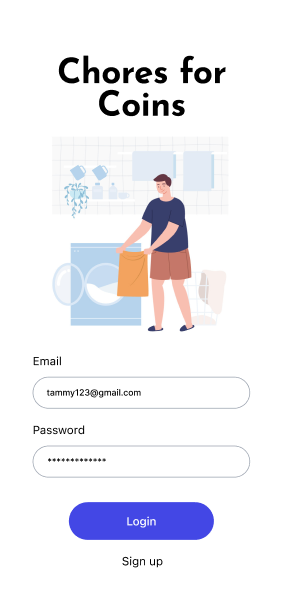
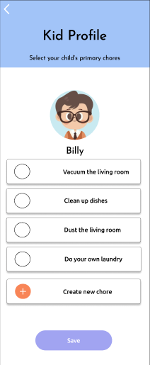
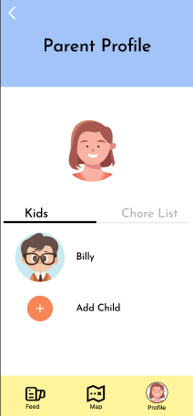
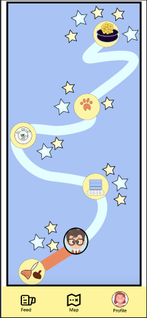

#  Chores for Coins

## Winner of General Assembly's 2023 Spring Hack-A-Thon

The app was designed to assist parents in teaching their children the value of money and patience. Our app rewards kids with coins for completing tasks or chores while working toward a goal or price agreed upon by their parents! Track your child’s progress with a gameboard, and watch them get closer to their goal as they complete more chores. 

## :framed_picture: **Screenshots of Project**
<!--  -->

 
 

# Team Members:
## Developers
- Brendon Von <a href='https://github.com/brendonvan'>GitHub</a> | <a href='https://brendonvan.dev/'>Portfolio</a> | <a href='https://www.linkedin.com/in/brendon-van/'>LinkedIn</a>  
- Harrison Weisberg <a href='https://github.com/hpweisberg'>GitHub</a> | <a href='https://harrisonweisberg.com/'>Portfolio</a> | <a href='https://www.linkedin.com/in/harrisonweisberg/'>LinkedIn</a>  
- Ian Chan <a href='https://github.com/ianchan3'>GitHub</a> | <a href='https://www.ianchanportfolio.com/'>Portfolio</a> | <a href='https://www.linkedin.com/in/ianchan-/'>LinkedIn</a>  

## UX/UI Designers
- Sachi Shirali <a href='https://www.sachishirali.com/'>Portfolio</a> | <a href='https://www.linkedin.com/in/sachi-shirali/'>LinkedIn</a>  
- Teresa Witzke <a href='https://www.teresakaelyn.com/'>Portfolio</a> | <a href='https://www.linkedin.com/in/teresa-witzke/'>LinkedIn</a>  
- Yasmin Sikavi <a href='https://www.linkedin.com/in/yasmin-sikavi/'>LinkedIn</a>  

## :pager: **Technologies Used**

## :link: **Links**

- <a href='https://docs.google.com/presentation/d/10Anec0pa49OKI8k84iQb2XyztkQjf_X3dDNwyaI-VOM/edit?usp=sharing'>Presentation Deck</a>

## 🧊 Ice Box

- [ ] Create Kid Portal to view chores
- [ ] Earn badges as you complete benchmark goals
- [ ] Create calendar and notfication system
- [ ] Have map update to refelect user progress

## 🛠️ Known Bugs

- Adding tasks does not save to child
- Account login is not propperly fetching complete profile